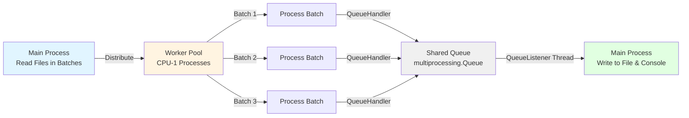

# CSV & PAS to HL7 Processing Script

## Overview
This script is a configurable, high-performance CSV and PAS to HL7v2 converter designed for healthcare data processing. It processes patient data files from a configurable input folder, validates and transforms the data into `Patient` objects (defined in `patientinfo.py`), and generates standardised HL7v2 ADT (Admission, Discharge, Transfer) messages. The system supports multiple event types (A01, A04, A08, A28, A31) and uses modular segment generators in the `segments` directory to construct compliant HL7v2 messages. Output files are saved to a configurable output directory with organised folder structures based on patient birth years.

**Key Features:**
- **Configurable**: All settings managed via JSON configuration
- **High Performance**: Multi-core parallel processing with process-safe logging
- **Robust**: Comprehensive error handling and data validation
- **Healthcare Compliant**: Generates valid HL7v2 messages with proper formatting
- **Scalable**: Handles large datasets with memory-efficient streaming
- **100% Log Fidelity**: Multiprocessing-safe logging ensures every message is captured

## Table of Contents

1. [Project Structure](#project-structure)
2. [Data Validation](#data-validation)
3. [HL7 Message Construction](#hl7-message-construction)
4. [File Naming Convention](#file-naming-convention)
5. [Configuration](#configuration)
   - [Configuration File Structure](#configuration-file-structure)
   - [Configuration Options](#configuration-options)
   - [Configuration Methods](#configuration-methods)
   - [Example Configuration](#example-configuration)
   - [Environment-Specific Configurations](#environment-specific-configurations)
   - [Configuration Validation and Testing](#configuration-validation-and-testing)
   - [Troubleshooting Configuration](#troubleshooting-configuration)
   - [Configuration API Reference](#configuration-api-reference)
6. [Script Execution](#script-execution)
   - [Prerequisites](#prerequisites)
   - [Quick Start](#quick-start)
   - [Detailed Steps](#detailed-steps)
   - [Performance Notes](#performance-notes)
7. [Logging and Multiprocessing](#logging-and-multiprocessing)
   - [Multiprocessing Architecture](#multiprocessing-architecture)
   - [Process-Safe Logging](#process-safe-logging)
   - [Log Features](#log-features)
   - [Healthcare-Grade Audit Trail](#healthcare-grade-audit-trail)
8. [Log Searching and Analysis](#log-searching-and-analysis)
9. [Important Notes](#important-notes)
10. [Contact Information](#contact-information)

Please make sure to review the [important notes](#important-notes). 

If you have any questions or queries, please refer to the [contact information](#contact-information) below.


## Project Structure 
The directory layout should look as follows:
- CSVTOHL7 (root of directory)
    - logs
    - sample_CSVs
        - ``patient_test_cases_edge.csv``
        - ``patient_test_cases_invalid.csv``
        - ``patient_test_cases_valid_extended.csv``
        - ``patient_test_cases_valid.csv``
    - segments
        - ``create_evn.py``
        - ``create_msh.py``
        - ``create_pid.py``
        - ``create_pv1.py``
        - ``segment_utilities.py``
    - tests
        - ``test_sample_data.py``
    - ``config.json`` (auto-generated configuration file)
    - ``config_manager.py`` (configuration management module)
    - ``CONFIGURATION_GUIDE.md`` (detailed configuration documentation)
    - ``hl7_utilities.py``
    - ``LFchecker.py`` (line feed checker utility)
    - ``logger.py``
    - ``main.py``
    - ``patientinfo.py``
    - ``README.md``
    - ``requirements.txt``

## Data Validation
The system implements comprehensive data validation during `Patient` object creation:

- **Field Length Validation**: Ensures all fields comply with maximum permitted lengths
- **Data Format Validation**: Validates dates (YYYYMMDD format), phone numbers, and NHS numbers
- **Data Quality Checks**: Flags inconsistencies (e.g., death indicator vs. date of death)
- **Rule Validation**: Applies healthcare-specific rules (age limits, date relationships)
- **Error Logging**: All validation issues are logged with patient identifiers for data quality review
- **Graceful Degradation**: Invalid records are skipped with detailed logging rather than stopping processing

## HL7 Message Construction
HL7v2 message construction follows healthcare industry standards:

**Supported Message Types:**
- **ADT^A01**: Admit/Visit Notification
- **ADT^A04**: Register a Patient  
- **ADT^A08**: Update Patient Information
- **ADT^A28**: Add Person Information (default)
- **ADT^A31**: Update Person Information

**Message Segments:**
- **MSH**: Message Header (configurable sending/receiving systems)
- **EVN**: Event Type (with timestamps)
- **PID**: Patient Identification (demographics, identifiers, addresses)
- **PV1**: Patient Visit Information (for A01 events)

**Message Generation Process:**
1. Validated `Patient` object created from input data
2. HL7 message template instantiated using `hl7apy` library
3. Modular segment generators populate each segment
4. Message validated and serialised with proper HL7 formatting
5. Files saved with unique timestamps and organised by birth year

## File Naming Convention
**Output Structure:**
```
output_hl7/
├── 1980/
│   ├── 20241203141523.00000001.hl7
│   └── 20241203141523.00000002.hl7
├── 1985/
│   └── 20241203141524.00000003.hl7
└── unknown/
    └── 20241203141525.00000004.hl7
```

**Naming Convention:**
- **Format**: `YYYYMMDDHHMMSS.NNNNNNNN.hl7`
- **YYYYMMDDHHMMSS**: Timestamp when message was created
- **NNNNNNNN**: 8-digit sequence number for uniqueness
- **Directory**: Organised by patient birth year (or 'unknown' if invalid/missing DOB)
- **Line Endings**: Proper HL7 line endings (CR only, ASCII 13) for healthcare system compatibility

## Configuration

The script is now
fully configurable via a JSON configuration file (`config.json`). On first run, a default configuration file will be created automatically with sensible defaults.

### Configuration File Structure

The configuration is stored in `config.json` with the following main sections:

#### 1. Directories

```json
"directories": {
  "input_folder": "input",
  "output_folder": "output_hl7"
}
```

#### 2. File Settings
Configures file parsing behavior:
```json
"file_settings": {
  "pas_separator": "|",
  "patient_mapping": {
    "internal_patient_number": 1,
    "assigning_authority": 2,
    "hospital_case_number": 3,
    "nhs_number": 4,
    "nhs_verification_status": 5,
    "surname": 6,
    "forename": 7,
    "date_of_birth": 8,
    "sex": 9,
    "patient_title": 10,
    "address_line_1": 11,
    "address_line_2": 12,
    "address_line_3": 13,
    "address_line_4": 14,
    "address_line_5": null,
    "postcode": 15,
    "death_indicator": 16,
    "date_of_death": 17,
    "registered_gp_code": 18,
    "ethnic_code": 19,
    "home_phone": 20,
    "work_phone": 21,
    "mobile_phone": 22,
    "registered_gp": 23,
    "registered_practice": 24
  }
}
```

**Field Descriptions:**
- `pas_separator`: Field delimiter for PAS format files (default: pipe "|")
- `patient_mapping`: Maps patient data field names to column indices in source files
  - Indices are 0-based positions in the CSV/PAS record
  - Use `null` for fields not present in source data
  - Allows adapting to different file formats without code changes

#### 3. HL7 Settings
Configures HL7 message header (MSH segment) fields:
```json
"hl7_settings": {
  "sending_application": "CSV2HL7_Converter",
  "sending_facility": "Data_Processing_Center",
  "receiving_application": "Hospital_Information_System",
  "receiving_facility": "Main_Hospital",
  "default_event_type": "A28",
  "hl7_version": "2.4",
  "processing_id": "T",
  "accept_acknowledgment_type": "AL",
  "application_acknowledgment_type": "NE"
}
```

**Field Descriptions:**
- `sending_application`: MSH-3 - Identifies the sending application
- `sending_facility`: MSH-4 - Identifies the sending facility
- `receiving_application`: MSH-5 - Identifies the receiving application
- `receiving_facility`: MSH-6 - Identifies the receiving facility
- `default_event_type`: EVN-1 - Default ADT event type (A01, A04, A08, A28, A31)
- `hl7_version`: MSH-12 - HL7 version (typically "2.4")
- `processing_id`: MSH-11 - Processing ID (T=Test, P=Production, D=Debug)
- `accept_acknowledgment_type`: MSH-15 - Accept acknowledgment type
- `application_acknowledgment_type`: MSH-16 - Application acknowledgment type

#### 4. Patient Settings
Configures patient identification fields:
```json
"patient_settings": {
  "assigning_authority": "RX1"
}
```

**Field Descriptions:**
- `assigning_authority`: PID-3.5 - Authority that assigned the patient identifier

#### 5. PV1 Settings
Configures Patient Visit (PV1) segment fields:
```json
"pv1_settings": {
  "patient_class": "O",
  "patient_type": "O",
  "visit_institution": "MAIN_HOSPITAL",
  "attending_doctor_id": "ACON",
  "attending_doctor_name": "ANAESTHETICS CONS",
  "attending_doctor_type": "L",
  "referring_doctor_name": "ANAESTHETICS CONS",
  "referring_doctor_id": "AUSHICPR"
}
```

**Field Descriptions:**
- `patient_class`: PV1-2 - Patient class (I=Inpatient, O=Outpatient, E=Emergency, P=Preadmit, R=Recurring, B=Obstetrics)
- `patient_type`: Legacy compatibility field
- `visit_institution`: PV1-3 - Assigned patient location/institution name
- `attending_doctor_id`: PV1-7 - Attending physician identifier
- `attending_doctor_name`: PV1-8 - Attending physician name
- `attending_doctor_type`: PV1-8 - Attending physician degree/type (L=License, M=MD, etc.)
- `referring_doctor_name`: PV1-9 - Referring physician name
- `referring_doctor_id`: PV1-9 - Referring physician identifier

#### 6. Processing Settings
Controls batch processing and performance:
```json
"processing": {
  "batch_size": 1000,
  "max_workers": null,
  "max_retries": 3
}
```

**Field Descriptions:**
- `batch_size`: Number of records processed in each batch (default: 1000)
- `max_workers`: Maximum parallel worker processes (null = auto-detect as CPU count - 1)
- `max_retries`: Number of retry attempts for failed batches

#### 7. Logging Settings
Controls logging behavior:
```json
"logging": {
  "log_directory": "logs",
  "log_level": "INFO"
}
```

**Field Descriptions:**
- `log_directory`: Directory for log files (default: 'logs')
- `log_level`: Logging verbosity (DEBUG, INFO, WARNING, ERROR, CRITICAL)
  - **INFO**: Recommended for production (batch summaries, errors, warnings)
  - **DEBUG**: Detailed per-record logging (verbose, for troubleshooting only)
  - **WARNING**: Only warnings and errors
  - **ERROR**: Only errors and critical issues

### Configuration Methods 
**1. Automatic Setup** (Recommended for first-time setup):
```bash
python main.py  # Automatically creates config.json with sensible defaults
```

**2. Manual Editing**:
```bash
# Edit config.json directly with any text editor
nano config.json    # Linux/Mac
notepad config.json # Windows
code config.json    # VS Code
```

### Example Configuration

```json
{
  "directories": {
    "input_folder": "input",
    "output_folder": "output_hl7"
  },
  "file_settings": {
    "pas_separator": "|",
    "patient_mapping": {
      "internal_patient_number": 1,
      "assigning_authority": 2,
      "hospital_case_number": 3,
      "nhs_number": 4,
      "nhs_verification_status": 5,
      "surname": 6,
      "forename": 7,
      "date_of_birth": 8,
      "sex": 9,
      "patient_title": 10,
      "address_line_1": 11,
      "address_line_2": 12,
      "address_line_3": 13,
      "address_line_4": 14,
      "address_line_5": null,
      "postcode": 15,
      "death_indicator": 16,
      "date_of_death": 17,
      "registered_gp_code": 18,
      "ethnic_code": 19,
      "home_phone": 20,
      "work_phone": 21,
      "mobile_phone": 22,
      "registered_gp": 23,
      "registered_practice": 24
    }
  },
  "hl7_settings": {
      "sending_application": "CSV2HL7_Converter",
      "sending_facility": "Data_Processing_Center", 
      "receiving_application": "Hospital_Information_System",
      "receiving_facility": "Main_Hospital",
      "default_event_type": "A28",
      "hl7_version": "2.4",
      "processing_id": "T",
      "accept_acknowledgment_type": "AL",
      "application_acknowledgment_type": "NE"
  },
  "patient_settings": {
      "assigning_authority": "RX1"
  },
  "pv1_settings": {
      "patient_class": "O",
      "patient_type": "O", 
      "visit_institution": "MAIN_HOSPITAL",
      "attending_doctor_id": "ACON",
      "attending_doctor_name": "ANAESTHETICS CONS",
      "attending_doctor_type": "L",
      "referring_doctor_name": "ANAESTHETICS CONS",
      "referring_doctor_id": "AUSHICPR"
  },
  "processing": {
      "batch_size": 1000,
      "max_workers": null,
      "max_retries": 3
  },
  "logging": {
      "log_directory": "logs",
      "log_level": "INFO"
  }
}
```

## Logging and Multiprocessing

### Multiprocessing Architecture

The system uses Python's `ProcessPoolExecutor` for parallel batch processing with inter-process communication:

**Architecture Overview:**


**Key Components:**
1. **Main Process**: Manages file reading, batch distribution, and log collection
2. **Worker Processes**: Process batches in parallel, send logs via shared queue
3. **Shared Queue**: `multiprocessing.Queue` for inter-process log message transport
4. **Queue Listener**: Background thread in main process that writes all logs to file

**Benefits:**
- **No Lock Contention**: Workers never compete for file access
- **Non-Blocking**: Workers continue processing while logs are written asynchronously
- **Scalable**: Handles thousands of messages per second without slowdown
- **Windows Compatible**: Uses `spawn` process creation method for cross-platform support

### Process-Safe Logging

The logging system uses the `QueueHandler` + `QueueListener` pattern to ensure **every single log message** is captured, even with multiple worker processes:

**How It Works:**
1. **Main Process Setup**:
   - Creates `multiprocessing.Queue` (shared across all processes)
   - Starts `QueueListener` thread that monitors the queue
   - Listener writes messages to file and console

2. **Worker Process Setup**:
   - Receives queue reference via `ProcessPoolExecutor` initializer
   - Configures `QueueHandler` to push logs into shared queue
   - All logging calls are non-blocking and fast

3. **Shutdown Protocol**:
   - `flush_queue()` ensures queue is drained before exit
   - Waits up to 10 seconds for all messages to be written
   - Displays progress for visibility

**Why This Matters:**
- **Audit Trail Completeness**: Every error, warning, and processing decision is logged
- **Data Quality Tracking**: No lost messages means complete traceability
- **Compliance**: Regulatory requirements for complete audit trails are met
- **Troubleshooting**: All information available for investigation

### Log Features

**Daily Rotation with Retention:**
- Log files rotate automatically at midnight
- Format: `app-YYYYMMDD.log`
- 7 days of historical logs maintained automatically
- Configurable retention period

**Configurable Log Levels:**
- **DEBUG**: Verbose per-record logging (development only, impacts performance)
- **INFO**: Batch summaries, saves, errors, warnings (recommended for production)
- **WARNING**: Only warnings and errors
- **ERROR**: Only errors and critical issues
- **CRITICAL**: System-level failures only

**Log Format:**
```
YYYY-MM-DD HH:MM:SS,mmm - LEVEL - MESSAGE
```

Example:
```
2026-02-06 14:23:45,123 - INFO - Starting to process batch input.txt:5 with 1000 records
2026-02-06 14:23:45,234 - ERROR - Skipping record in batch input.txt:5 record 127 (Patient ABC123) - incorrect number of fields (found 24, expected 26)
2026-02-06 14:23:46,567 - INFO - Successfully saved 998 messages for batch input.txt:5
2026-02-06 14:23:46,568 - INFO - Batch input.txt:5 completed: 1000/1000 records (processed=998, skipped=0, errors=2) in 1.44s
```

**Console Output:**
- Real-time feedback during processing
- Log level: INFO and above (errors, warnings, batch summaries)
- Colour-coded by severity (if terminal supports it)
- Progress indicators for long-running operations

### Audit Trail

**Record Accountability:**
Every record is accounted for in one of three categories:
1. **Errors**: Records that failed validation and were never initialized (logged with patient ID if available)
2. **Initialized**: Records that passed validation and created Patient objects
3. **Saved**: Records that generated HL7 messages successfully

**Verification Math:**
```
Total Records = Errors + Initialized
Initialized = Saved + Skipped
```

**Automated Analysis:**
The `analyze_logs.py` script performs automatic verification:
```bash
python analyze_logs.py
```

Output includes:
```
Processing Summary:
  Total Records:     11,935
  Errors (skipped):  509 (invalid format, never initialized)
  Initialized:       11,426
  Skipped:           257 (initialized but failed validation)
  Saved to HL7:      11,169

Verification: 509 errors + 11,426 initialized = 11,935
              11,169 saved + 257 skipped = 11,426
```

**Patient & Batch Tracking:**
- All log messages reference patient internal numbers
- Search logs by patient ID: `grep "ABC123" logs/app.log`
- Complete audit trail per patient from input to output
- Each batch has unique identifier (filename:batch_number)
- Processing statistics and performance metrics logged per batch

**Data Quality Alerts:**
- Invalid field lengths and formats
- Missing required data (surname, DOB)
- Date inconsistencies (death before birth)
- NHS number validation failures
- Hospital case number issues
- Encoding and parsing errors

### Troubleshooting Configuration

#### Common Configuration Issues

**1. Invalid Event Type**:
```
Error: Configuration 'hl7_settings.default_event_type' must be one of ['A01', 'A04', 'A08', 'A28', 'A31']
```
Solution: Use a valid ADT event type from the allowed list.

**2. Missing Required Fields**:
```
Error: Configuration 'hl7_settings.sending_application' is missing or empty
```
Solution: Provide all required configuration values.

**3. Invalid Batch Size**:
```
Error: Configuration 'processing.batch_size' must be a positive integer
```
Solution: Set batch_size to a positive number (recommended: 1000-5000).

#### Configuration Recovery
If configuration becomes corrupted:
```bash
# Delete and regenerate with defaults
rm config.json
python main.py  # Will create fresh default config
```

### Configuration API Reference

The `ConfigManager` class provides getter methods for all configuration values:

#### Directory Methods
- `get_input_folder()` → str
- `get_output_folder()` → str

#### File Settings Methods
- `get_pas_separator()` → str
- `get_patient_mapping()` → Dict[str, Any]

#### HL7 Settings Methods
- `get_sending_application()` → str
- `get_sending_facility()` → str
- `get_receiving_application()` → str
- `get_receiving_facility()` → str
- `get_default_event_type()` → str
- `get_hl7_version()` → str
- `get_processing_id()` → str
- `get_accept_acknowledgment_type()` → str
- `get_application_acknowledgment_type()` → str

#### Patient Settings Methods
- `get_assigning_authority()` → str

#### PV1 Settings Methods
- `get_pv1_patient_class()` → str
- `get_pv1_patient_type()` → str
- `get_pv1_visit_institution()` → str
- `get_pv1_attending_doctor_id()` → str
- `get_pv1_attending_doctor_name()` → str
- `get_pv1_attending_doctor_type()` → str
- `get_pv1_referring_doctor_name()` → str
- `get_pv1_referring_doctor_id()` → str

#### Processing Methods
- `get_batch_size()` → int
- `get_max_workers()` → int (auto-detects if configured as null)
- `get_max_retries()` → int

#### Logging Methods
- `get_log_directory()` → str
- `get_log_level()` → str

#### Utility Methods
- `validate_config()` → List[str]: Returns list of validation issues
- `save_config(path)`: Save configuration to file
- `load_config(path)`: Load configuration from file
- `get(key_path, default)`: Get value using dot notation (e.g., 'hl7_settings.sending_application')
- `set(key_path, value)`: Set value using dot notation

## Script Execution

### Prerequisites
1. **Python 3.7+** (tested with Python 3.13)
2. **Install Dependencies**: 
   ```bash
   python -m pip install -r requirements.txt
   ```

### Quick Start
```bash
# 1. Add your CSV/PAS files to input folder
cp your_patient_data.csv input/

# 2. Run the converter (creates default config.json if needed)
python main.py

# 3. (Optional) Customize config.json for your environment
```

### Detailed Steps

1. **Prepare Input Files**: 
   - Place CSV and PAS files in the configured input folder (default: `input/`)
   - Supported formats: `.csv` (comma-separated) and `.txt` (PAS format)
   - Files should contain 25 columns of patient data as per the expected schema

3. **Run the Script**:
   ```bash
   python main.py
   ```

4. **Monitor Progress**:
   - Configuration validation occurs on startup
   - Current settings are logged for transparency
   - Processing progress is logged in real-time
   - Check `logs/` directory for detailed processing logs

5. **Review Output**:
   - HL7 messages saved to configured output folder (default: `output_hl7/`)
   - Files organised by patient birth year for easier management
   - Each message is a separate `.hl7` file with unique naming

## Log Searching and Analysis

The comprehensive logging system makes it easy to search for specific issues, patients, or events using standard command-line tools like `grep`. Here are practical examples for common scenarios:

### Search by Log Level

**Find all errors:**
```bash
grep "ERROR" logs/app-*.log
```

**Find all warnings:**
```bash
grep "WARNING" logs/app-*.log
```

**Find critical issues:**
```bash
grep "CRITICAL" logs/app-*.log
```

**Find all errors and warnings:**
```bash
grep -E "(ERROR|WARNING)" logs/app-*.log
```

### Search by Patient

**Find all log entries for a specific patient:**
```bash
grep "TEST12345678" logs/app-*.log
```

**Find patients with missing surnames:**
```bash
grep "missing required surname" logs/app-*.log
```

**Find patients with data quality issues:**
```bash
grep -E "notify Data Quality team" logs/app-*.log
```

### Search by Processing Activity

**Find batch processing summaries:**
```bash
grep "Batch.*completed" logs/app-*.log
```

**Find file save operations:**
```bash
grep "Successfully saved HL7 message" logs/app-*.log
```

**Find processing failures:**
```bash
grep "Failed to" logs/app-*.log
```

**Find retry attempts:**
```bash
grep "Retrying.*failed batches" logs/app-*.log
```

### Search by Data Quality Issues

**Find NHS number validation issues:**
```bash
grep "NHS number.*over 10 chars\|NHS number.*non-numeric" logs/app-*.log
```

**Find hospital case number issues:**
```bash
grep "Hospital number.*over 25 chars" logs/app-*.log
```

**Find date format issues:**
```bash
grep "Invalid date" logs/app-*.log
```

**Find age-related exclusions:**
```bash
grep -E "age > 112|dod > 2 years ago" logs/app-*.log
```

### Advanced Search Examples

**Find today's processing activity:**
```bash
grep "$(date '+%Y-%m-%d')" logs/app-*.log
```

**Count errors by type:**
```bash
grep "ERROR" logs/app-*.log | cut -d'-' -f4- | sort | uniq -c | sort -nr
```

**Find patients processed in the last hour:**
```bash
grep "Patient initialized" logs/app-$(date '+%Y%m%d').log | tail -n 100
```

**Search across date range (last 3 days):**
```bash
for i in {0..2}; do
  date_str=$(date -d "$i days ago" '+%Y%m%d' 2>/dev/null || date -v-${i}d '+%Y%m%d')
  [ -f "logs/app-${date_str}.log" ] && grep "ERROR" "logs/app-${date_str}.log"
done
```

**Export search results to file:**
```bash
grep -E "(ERROR|WARNING)" logs/app-*.log > error_summary.txt
```

### Useful grep Options

- `-i`: Case-insensitive search
- `-n`: Show line numbers
- `-C 3`: Show 3 lines of context before and after matches
- `-A 5`: Show 5 lines after each match
- `-B 5`: Show 5 lines before each match
- `-c`: Count matching lines
- `-v`: Invert match (show non-matching lines)
- `-E`: Extended regex support
- `--color=always`: Highlight matches in color

**Example with context:**
```bash
grep -C 3 --color=always "TEST12345678" logs/app-*.log
```

These search patterns help quickly identify processing issues, track specific patients through the system, and analyse data quality problems for investigation.


## Important Notes

**Healthcare Compliance:**
- This system generates HL7v2 messages for healthcare data exchange
- Ensure compliance with local healthcare data regulations (HIPAA, GDPR, etc.)
- Test thoroughly in non-production environments before clinical use
- Validate message acceptance with receiving systems

**Configuration:**
- Review and customise `config.json` for your environment
- Validate HL7 field mappings match your requirements
- Test event types (A01, A28, etc.) with receiving systems
- Consider backup and disaster recovery for processing environments

**Data Quality:**
- Monitor logs for data quality issues requiring investigation
- Invalid records are skipped but logged for manual review
- Large age discrepancies (>112 years) are automatically excluded
- Death records >2 years old are filtered out by default

**Performance:**
- System designed for high-volume processing with parallel execution
- Memory usage optimised for large file processing
- Processing speed scales with available CPU cores
- Consider system resources when setting batch sizes and worker counts

## Contact Information
For any questions regarding this script, please contact David Kennedy by email at [david.kennedy@cirdan.com](mailto:david.kennedy@cirdan.com) on weekdays from 9am to 5pm GMT.

